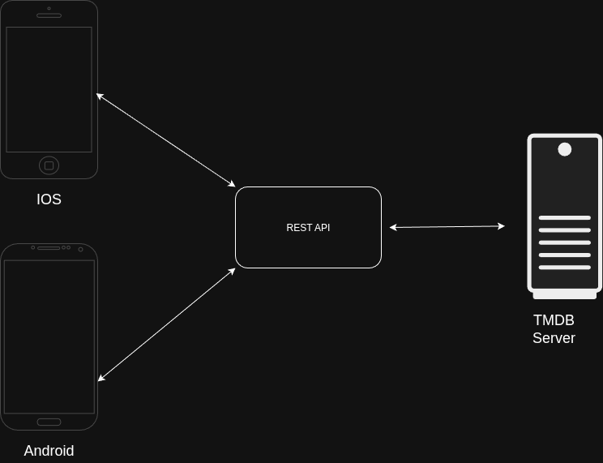

# Movie Tracking App
**By The Jojos**

---
# What is the problem?

- We watch a lot of movies. We can't remember all of it.

---
# We already do have a website for it but the process/step by step is sometimes annoying

---
# Accessing TMDB via website
**Open Google Chrome -> Search Tmdb website -> Select the website -> login -> Use app**

---

# Accessing movies via a mobile app
**Open Application -> Login -> Use app**

---

# App Architecture

---

## App Design Pattern (MVVM)

- Collaboration/Separation of concerns
- Scalability
- Testing.

---

## Features

# Sprint 1:

Feature 1 - Login Authentication
Feature 2 - UI/UX Design
Feature 3 - Rating/Scoring (Detail page)
Feature 4 - Comments

# Sprint 2:

Feature 5 - Lists (HomeScreen)
Feature 6 - Recommendataion Pages
Feature 7 - Profile Page
Feature 8 - Sorting Filtering

---

## Remaining week will be improving UI and maybe adding a bit more features