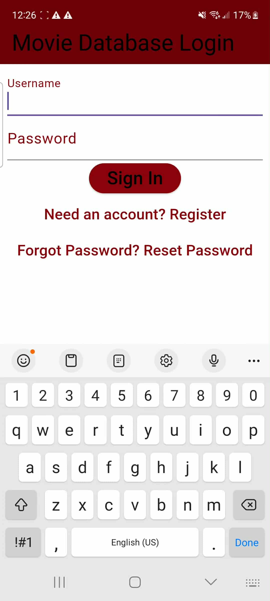

# Sprint 1 Presentation

---

# Demos

## Video 
<video width="720" height="405" controls>
  <source src="images-for-presentation/video-demo.mp4" type="video/mp4">
  Your browser does not support the video tag.
</video>

---
## Login

---
## Home Page

---
## Detail Page

---
## Review Page

---

## Progress Reports Summary
- Week 1:
  Set things up added code in our repo with some tweak to the code. LoC: 5468
- Week 2: 
  Login requirements(1/4). LoC: 142 
  burndown rate: 25% 
  Issues: Two people was working on 1 feature the last requirements needs to wait for the other member to finish.
---
- Week 3:
  Login requirement (3/3). LoC: 302
  Detail Page requirement (0/4)
  burndown rate: 37.5%
- Week 4:
  Home Page requirements(3/3)
  Ratings requirements(3/3)
  Reviews requirements(0/3)
  Detail Page requirement (0/4)
  burndown rate: 46.15%
---
**Total burndown rate**
7/14 * 100 = 58%
**Total LoC**
6247

---
### What Went Wrong (Team Level):
- Other members needs to wait for others to finish before they can start their tasks
- Some features took longer than expected to develop(Lack of time)
- Unclear requirements made it harder to create some features

---

### What Went Well (Team Level):
- Maintaned good collobration and communication with the team
- Team able to adapt in changes
- Login feature successfully implemented
- Reviews feature successfully implemented
- Home page completed
---

### Analysis & Improvement Plan (Team Level):
- Create a plan for Sprint 2 that allows team members to work independently without waiting for others to finish their tasks.
- Making requirements much more specific for Sprint 2
- Split complex feature requirements across multiple weeks to make them more manageable.

---

# Team Sprint 2 Metrics:

Goal: Finish remaining features from Sprint 1, Improve UI, and new features for Sprint 2

-  Number of team features planned: 6
-  Number of team requirements planned: 22
-  

---

- Week 1:
  Detail Pages
  - Detail pages must display title, release date, synopsis.
  - Pages must show cast, crew, and production details.
  - Similar/related movies must be listed.Must be able to add movie to list
  Profiles
  - Users must be able to create and edit a profile
  - Profiles must display a watchlist, favorites, and reviews.
  - Allow users to change settings (light/dark mode)
  - Users must be able to log out from all devices

---

- Week 2:
  Ratings
  - Users must be able to rate movies on a 1–10 scale.
  - Ratings must be editable or removable by the user.
  - User ratings must be aggregated into an average score.

---
  
  Search/Filter
  - Users must be able to search movies/TV shows by title, keyword, or cast. 
  - Filters must support genre, year, rating, and country. 
  - Search results must update dynamically as the user types.
  - Users must be able to clear filters and reset to default view.
  - Get recommendations while searching

---

- Week 3:
  Watchlist
  - Users must be able to add/remove movies to their watchlist.
  - Users must be able to mark movies as favorites.
  - Lists must display in chronological order (added date).
  - Lists must be editable (remove items, reorder).
  
---

- Week 4:
  Recommendations
  - The system must generate recommendations based on user ratings and watchlist.
  - Recommendations must update after list changes.
  - Recommendations must display at least 10 suggested movies/TV shows.

---
# Timeline and Milestone

---
## Timeline & Milestones

## Timeline & Milestones (Sprint 1)

| Week | Focus | Key Milestone | Status |
|------|-------|---------------|--------|
| 1 | Project setup | Added initial code to repo (LoC: 5468) | ✅ |
| 2 | Login requirements (1/4) | Partial login functionality; burndown: 25% | ✅ |

---
| Week | Focus | Key Milestone | Status |
|------|-------|---------------|--------|
| 3 | Login (3/3), Detail Page (0/4) | Login fully functional; detail page pending; burndown: 37.5% | incomplete |
| 4 | Home Page (3/3), Ratings (0/3), Reviews (3/3), Detail Page (0/4) | Core pages partially complete; burndown: 46.15% | incomplete |

---

## Timeline & Milestones (Sprint 2)

| Week | Focus | Key Milestone | Status |
|------|-------|---------------|--------|
| 1 | Detail Pages, Profiles | Detail pages show movie info; profiles created/edited | in-progress |
| 2 | Ratings, Search/Filter | Users can rate movies, search/filter dynamically | in-progress |

---
| Week | Focus | Key Milestone | Status |
|------|-------|---------------|--------|
| 3 | Watchlist | Watchlist and favorites feature implemented | in-progress |
| 4 | Recommendations | Recommendation system operational | in-progress |

